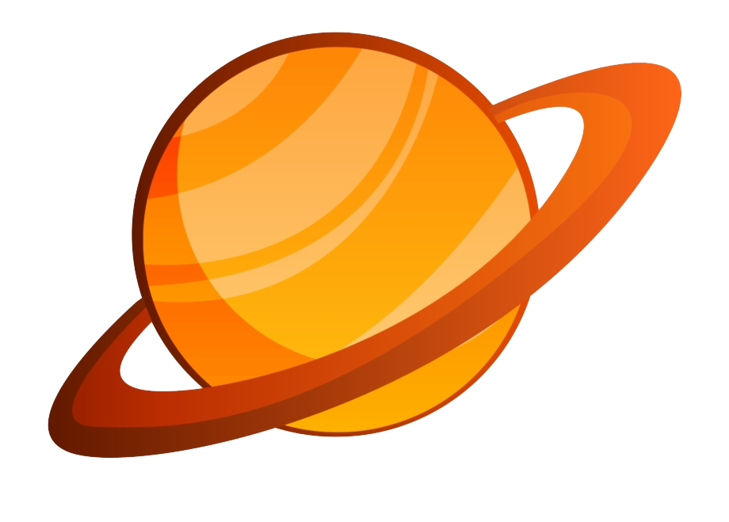
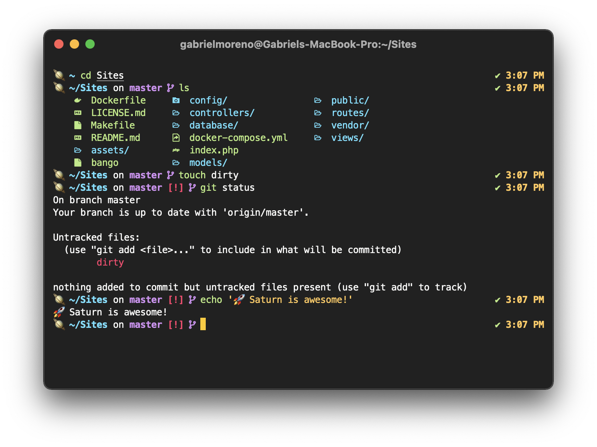

<div align="center">
  
  <h1>Saturn</h1>
</div>

<h4 align="center">🪐 A ZSH theme for space lovers out there</h4>

Saturn is a soft & minimalistic prompt for those who love space and want to have a bit of it on their terminal, featuring cool emojis & highly customizable prompt elements (such as icons, colors, time format, and more).

<div align="center">
  
  <br>
  <sub>Saturn prompt on iTerm2 and <a href="https://github.com/equinusocio">equinusocio</a>'s Material Theme Darker</sub>
</div>

## Installation

| Method | Command                                                                                          |
| :----- | :----------------------------------------------------------------------------------------------- | ---- |
| cURL   | `curl -fsSL https://raw.githubusercontent.com/gantoreno/saturn-prompt/master/scripts/install.sh" | zsh` |
| WGET   | `wget -O- https://raw.githubusercontent.com/gantoreno/saturn-prompt/master/scripts/install.sh)"  | zsh` |

After that, in your `.zshrc`:

```sh
ZSH_THEME="saturn"
```

And voilà! Saturn is ready to go. 🚀

## License

Saturn is open-sourced software licensed under the [MIT license](https://opensource.org/licenses/MIT).
